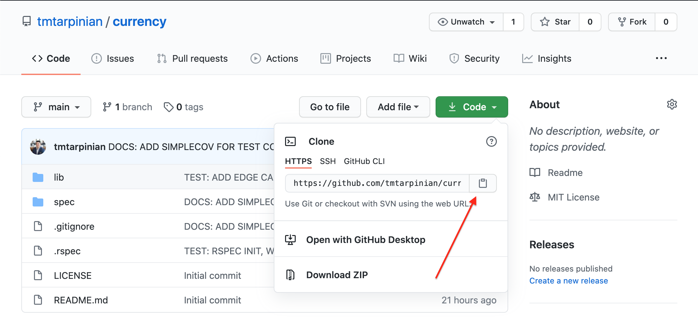

# Currency

 
> Calculates the possible combinations a set of currency can make, given a target sum of money.

### Table of Contents

- [Summary](##Summary)
- [Dependencies](##Dependencies)
    - [Ruby](###Ruby)
        - [Changing Ruby Versions](####Changing_Versions)
        - [Installing Ruby Versions](####Installing_Versions)
    - [Faker](###Faker)
    - [Colorize](###Colorize)
- [Run](##Run)
- [Improvement](##Improvement)
    - [Stories](###Stories)
    - [Contributing](###Contributing)
- [Acknowledgements](##Acknowledgements)
- [License](##license)
- [Maintainers](##Maintainer(s))

---
## Summary
This repo has three alogorithms in three respective files within the `lib` directory.
The file `currency` contains a Ruby method that will calculate and print the possible combinations that U.S. Quarters, Dimes, Nickels, and Pennies can make to sum $1.

The file `anarchy_currency` contains an Ruby method that will calculate and print the possible <ins>exact</ins> combinations an arbitrary set of currency values can make to equal an arbitrary sum.

The `bonus` file contains a Ruby method that uses the Faker gem to generate arbitrary currency names, assigns them a random value, and then calculates and prints the possible <ins>exact</ins> combinations that arbitrary set of currency values can make to equal a random sum. In some cases, no possibilities for a combination with an exact sum are possible.

---
## Dependencies
The following requirements are necessary to run these files:
- Ruby ~>2.6.1
- Faker gem
- Colorize gem

### Ruby

These files are written with Ruby and requires Ruby version ~>2.6.1 to be installed on the operating system executing the program.

#### Changing_Versions
If Ruby is installed on your system, verify the currently used version with the command `ruby -v`

You can list all installed Ruby versions on your machine with `rvm list`

Changing the currently used version of Ruby to a version ~>2.6.1 can be achieved with the command `rvm use 2.6.1` (or your specified version).

Running `rvm list` again will confirm that that version is the current

#### Installing_Versions
If you do not have a version of Ruby version  ~>2.6.1 on your machine you, can obtain it by running `rvm install 2.6.1`.

This installation requires `Ruby Version Manager` (RVM). If RVM is not installed on your machine, that can be downloaded and installed with the following command:

`curl -sSL https://get.rvm.io | bash`

When RVM is installed, run `rvm reload` or close and reopen your terminal to make sure RVM is fully loaded. Next, install the Ruby version ~>2.6.1 with the subsequent commands:

`rvm install 2.6.1`
`rvm use 2.6.1`

Please see the [Ruby installation instructions](https://www.ruby-lang.org/en/documentation/installation/) for further information about installing RVM or a Ruby verion on your machine.

To run either `currency.rb` or `anarchy_currency.rb` file, this is the only dependency needed. To run the `bonus.rb`, the `Faker` and `Colorize` gems are required to run. Please continue reading

### Faker
The `bonus.rb` file uses the [Faker](https://github.com/faker-ruby/faker) gem.

This will need to be manually installed prior to running the `bonus.rb` file, since there is currently no Gemfile, bundler, or environmnent.rb file in the repo (for the moment!).

To install, in your terminal, run `gem install faker`.
[Find the Faker documentation here](https://github.com/faker-ruby/faker)

### Colorize
Finally, the `bonus.rb` file uses the [Colorize](https://github.com/fazibear/colorize) gem.

This will need to be manually installed prior to running the `bonus.rb` file, since there is currently no Gemfile, bundler, or environmnent.rb file in the repo (for the moment!).

To install, in your terminal, run `gem install colorize`.
[Find the Colorize documentation here](https://github.com/fazibear/colorize)

---
## Run

To run any of the files, [visit the file's repo on Github](https://github.com/tmtarpinian/currency).

From there, download a zipped copy of the repo files or use its web url to clone.
 

Please have Ruby, Faker, and the Colorize gems installed prior to running this application ([see Dependencies above](##Dependencies))

After unzipping and saving the contents to the desired directory (or using `git clone` to clone the repo in your terminal), change directories to the directory containing the copy of the repo.

From within that directory, run any of the following commands in your terminal:
1. `ruby ./lib/currency.rb` (to run the `currency` algorithm)
2. `ruby ./lib/anarchy_currency.rb` (to run the `anarchy_currency` algorithm)
3. `ruby ./lib/bonus.rb` (to run the `bonus` algorithm)

These files do <ins>not</ins> produce any prompts since there is no CLI file at this time.

If you would like to re-run any of the algorithms to see their respective print outs again, please retype the corresponding command in the terminal.

For the `bonus.rb` file, new `Faker` seed data is generated each time the file is executed. Running the algorithm several times in a row should provide different (and hopefully entertaining!) results.

---

## Improvement
This project was originally started to write two algorithms. Those two files, along with the `bonus.rb`, don't warrant a Gemfile, environment.rb, or a file dedicated to controlling the CLI. However, going forward, the `bonus.rb` can be reworked as the basis of a small CLI Ruby app.

### Stories
To expand the `bonus.rb`file to a CLI Ruby app, the next tasks might look like this:

- [ ] FEAT: Create a CLI file
- [ ] BUILD: Create a Gemfile, environment file, and bundler
- [ ] CHORE: Add Github Actions for continuous integration
- [ ] BUILD: Move the [printer functions](./lib/bonus.rb#L46-70) to their own file as helpers
- [ ] BUILD: Move the [currency_maker](./lib/bonus.rb#L82-89) method to its own file to separate concerns
- [ ] PERF: Improve the O(n^2) time complexity in the [printer method](./lib/bonus.rb#L55-58)
- [ ] TEST: Write unit tests for these individual methods
- [ ] TEST: Update the initial "unit" test as an end-to-end test
- [ ] TEST: Add an integration test for methods employing the `Faker` gem.

### Contributing

Bug reports and pull requests are welcome on GitHub at https://github.com/tmtarpinian/currency. PRs can be made from the main branch (at the moment), but a development branch will be created after a Gemfile and `environment.rb` file are added to the project.

This project is intended to be a safe, welcoming space for collaboration, and contributors are expected to adhere to the [Contributor Covenant](http://contributor-covenant.org) code of conduct.

---

## Acknowledgements

Banner photo is property of C.R.O.N.U.S Foundation and Dark Crystal Games © 2018 All Rights Reserved

Thanks to the good folks at [Faker](https://github.com/faker-ruby/faker) that keep supplying us with time-saving and entertaining seed data.

---

## License

The app is available as open source under the terms of the [MIT License](https://opensource.org/licenses/MIT).

---
## Maintainer(s)

|      |
| :------------- | 
|[@tmtarpinian](https://github.com/tmtarpinian) |
